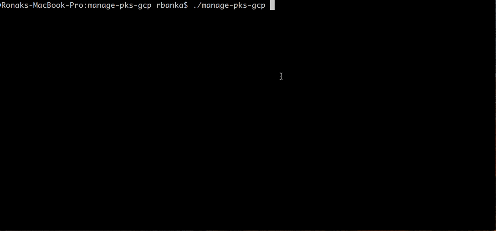

# Manage PKS on GCP

Automate Load balancer configuration & PKS cluster access on GCP.

## Demo


## What these scripts are not meant for (YET) !
* Automate PKS deployment on GCP
* Configure GCP SDK client
* Handle PKS cli authentication

## Before you begin
You need:

* [PKS cli](https://docs.pivotal.io/runtimes/pks/1-3/installing-pks-cli.html)
* [GCP sdk client](https://cloud.google.com/sdk/downloads)
* [jq](https://stedolan.github.io/jq/download/)

### Instructions

1. Start by configuring PKS API access, please find detailed docs [here](https://docs.pivotal.io/runtimes/pks/1-3/configure-api.html).
  ```
  pks login -a PKS-API --client-name CLIENT-NAME --client-secret CLIENT-SECRET -k
  ```

2. Configure GCP SDK client, log in to GCP

  ```
  $ gcloud auth login
  ```
3. Configure GCP compute region, same as [AZ configuration](https://docs.pivotal.io/runtimes/pks/1-3/gcp-om-config.html#az) for PKS tile
  ```
  gcloud config set compute/region $GCP_REGION
  ```

4. Start by provisioning a new cluster, this step will reserve a IP on GCP & will issue create cluster command.
  ```
  ./manage-pks-gcp provision
  ```

5. It will take some time to provision cluster, **check status with `pks cluster cluster-name` before proceeding to next step.**

6. Once cluster provision status is `succeeded`, enable access using
  ```
  ./manage-pks-gcp access
  ```
  and follow instructions. This step will:
  * Create load-balancer
  * Configure firewall-rule
  * Add master nodes to load-balancer based on tags
  * Configure the forwarding rule
  * Get credentials using PKS cli & set kubectl context

7. If you want to clean up GCP resources, loadbalancer, firewall-rule, forwarding-rule
  ```
  ./manage-pks-gcp cleanup
  ```
  Above cleanup doesn't release the IP which is reserved in step 4, so even after cleanup, repeat step 6 to enable access.

## Author
[Ronak Banka](https://github.com/ronakbanka)
